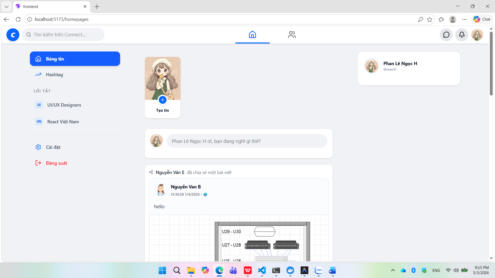
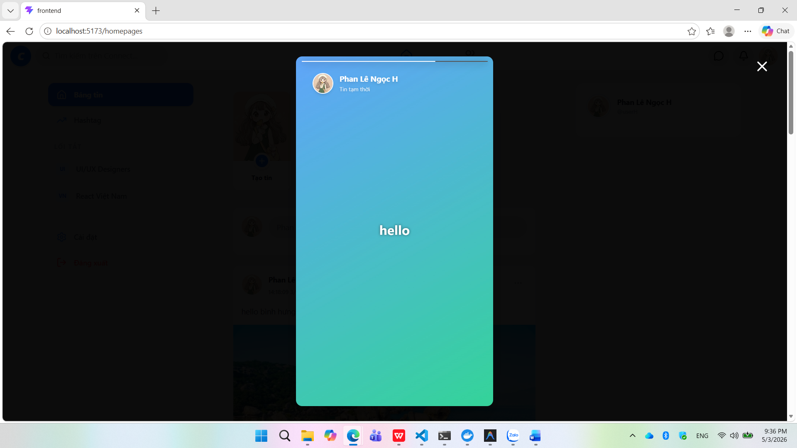
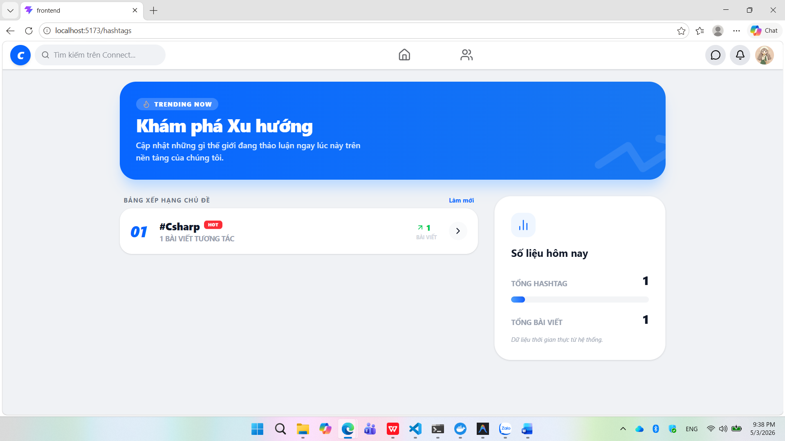
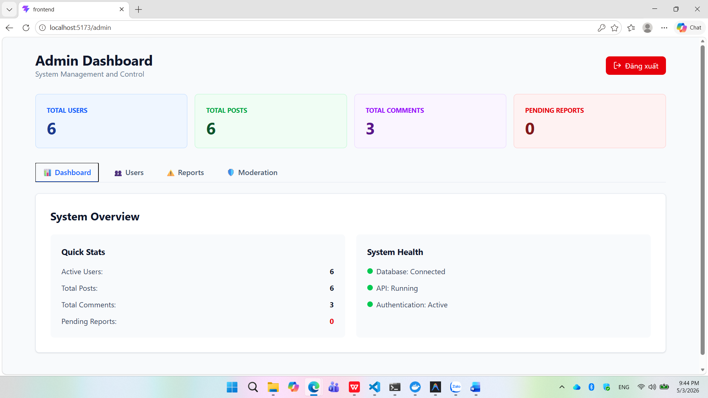

# InteractHub

InteractHub là nền tảng mạng xã hội (social network) cho phép người dùng:
- Tạo tài khoản và đăng nhập
- Đăng trạng thái, hình ảnh
- Bình luận, thích, chia sẻ bài viết
- Nhận thông báo thời gian thực
- Quản lý hồ sơ và cài đặt

## Cấu trúc dự án

- frontend/ : React + TypeScript SPA
- backend/  : ASP.NET Core Web API + EF Core
- docs/     : sơ đồ, báo cáo
- scripts/  : scripts deploy / migrate / seed data

## Hướng dẫn cài đặt
## chạy fontend
npm run dev

1. Frontend: `cd frontend && npm install && npm run dev`
2. Backend: `cd backend/InteractHub.API && dotnet restore && dotnet run`

